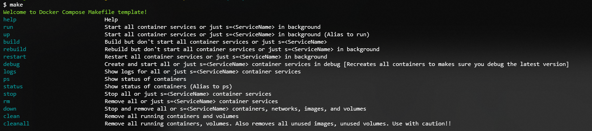

# Docker Compose Makefile

[](https://github.com/gegaryfa/DockerComposeMakefile/blob/master/LICENSE)


A docker compose makefile template

## Getting Started

Clone the repo, open a terminal and run 

```bash
make
``` 
to see all the possible actions.



### Prerequisites

* [`GNU Make`](https://www.gnu.org/software/make/)

### Usage

Place the `Makefile` and `config.env` files on the same folder as your docker-compose.yml file. This `makefile` uses a `docker-compose.override.yml` file but of course you can rename it[check the `config.env`]

## Sources
Overview of docker-compose CLI: [Docker Compose](https://docs.docker.com/compose/reference/overview/)


## Authors

* **George Garyfallou** - *Initial work* - [gegaryfa](https://github.com/gegaryfa)

## Acknowledgments

* Hat tip to anyone whose code was used
